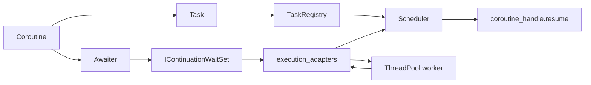

# execution_core and execution_adapters

> #### Status: documentation-only snapshot.  
> The source code for `execution_core` and `execution_adapters`
> is not included in this repository yet.
>
> Reason: the implementation is being prepared for public release.
> This repository is currently used to publish the API and architecture
> documentation first.
>
> API feedback is welcome. Suggestions regarding the API structure,
> ownership model, lifecycle protocol, scheduler boundaries, adapter
> boundaries, and public naming are appreciated before the source package
> is released.

## Purpose

`execution_core` and `execution_adapters` were created to provide a compact C++20 coroutine execution layer with explicit coroutine-state ownership, registry-controlled lifecycle validation, scheduler-controlled resumption, and adapter-based integration with external blocking or event-driven work.

The required model is centered on a universal `Task<T, StartPolicy>` abstraction: result type, start policy, and ownership of the coroutine state are handled by one task abstraction. The core also provides an explicit `TaskRegistry`, a formal lifecycle protocol, strict scheduler/adapter separation, continuation validation by task identity, generation, and coroutine-handle identity, and controlled return of externally completed work back into the scheduler.


> There are also similar coroutine return/awaitable types in
> <a href="https://github.com/facebook/folly/tree/main/folly/coro">Folly</a>,
> <a href="https://github.com/facebookexperimental/libunifex/tree/main">libunifex</a>,
> and <a href="https://github.com/boostorg/asio/tree/develop/include/boost/asio">Boost.Asio</a>.
> <ins>These implementations do not fully match the author's requirements</ins>, because the required model is:
> a compact C++20 coroutine core centered on a universal
> <code>Task&lt;T, StartPolicy&gt;</code> abstraction, where result type, start policy,
> and coroutine-state ownership are handled by one task abstraction;
> an explicit <code>TaskRegistry</code>;
> a formal lifecycle protocol;
> strict scheduler/adapter separation;
> continuation validation by task identity, generation, and coroutine-handle identity;
> and controlled return of externally completed work back into the scheduler.

`execution_core` defines task ownership, coroutine state tracking, continuation validation, scheduler interaction, cleanup, shutdown, and boundary exception handling.

`execution_adapters` connects external work to the core protocol through executors, wait-sets, background jobs, worker-local context support, and continuation return paths.

The implementation is intended to be built as C++20. The internal source tree uses `target_compile_features(... cxx_std_20)` in the module CMake configuration.

## API Reference
## Table of contents

<ol>
<li><a href="#1-module-overview">Module overview</a></li>
<li><a href="#2-c20-standard-grounding">C++20 standard grounding</a></li>
<li><a href="#3-file-structure">File structure</a></li>
<li><a href="#4-architectural-model">Architectural model</a></li>
<li>
<details>
<summary><a href="#5-core-protocol-concepts">Core protocol concepts</a></summary>
<div>
&nbsp;&nbsp;&nbsp;&nbsp;<a href="#51-task-ownership-model">5.1 Task ownership model</a><br>
&nbsp;&nbsp;&nbsp;&nbsp;<a href="#52-protocol-state-model">5.2 Protocol state model</a><br>
&nbsp;&nbsp;&nbsp;&nbsp;<a href="#53-continuation-and-token-model">5.3 Continuation and token model</a><br>
&nbsp;&nbsp;&nbsp;&nbsp;<a href="#54-wait-set-model">5.4 Wait-set model</a><br>
&nbsp;&nbsp;&nbsp;&nbsp;<a href="#55-boundary-exception-model">5.5 Boundary exception model</a><br>
&nbsp;&nbsp;&nbsp;&nbsp;<a href="#56-final-suspend-vs-finalsuspended-state">5.6 final_suspend vs FinalSuspended state</a><br>
</div>
</details>
</li>
<li>
<details>
<summary><a href="#6-execution_core-api">execution_core API</a></summary>
<div>
&nbsp;&nbsp;&nbsp;&nbsp;<a href="#61-taskid">6.1 TaskId</a><br>
&nbsp;&nbsp;&nbsp;&nbsp;<a href="#62-coroutinestate">6.2 CoroutineState</a><br>
&nbsp;&nbsp;&nbsp;&nbsp;<a href="#63-continuation">6.3 Continuation</a><br>
&nbsp;&nbsp;&nbsp;&nbsp;<a href="#64-waitsetregistration">6.4 WaitSetRegistration</a><br>
&nbsp;&nbsp;&nbsp;&nbsp;<a href="#65-resumetoken-and-starttoken">6.5 ResumeToken and StartToken</a><br>
&nbsp;&nbsp;&nbsp;&nbsp;<a href="#66-executionbinding">6.6 ExecutionBinding</a><br>
&nbsp;&nbsp;&nbsp;&nbsp;<a href="#67-coroutinecontrolblock">6.7 CoroutineControlBlock</a><br>
&nbsp;&nbsp;&nbsp;&nbsp;<a href="#68-taskt-startpolicy">6.8 Task&lt;T, StartPolicy&gt;</a><br>
&nbsp;&nbsp;&nbsp;&nbsp;<a href="#69-itaskrecord-and-taskrecordt">6.9 ITaskRecord and TaskRecord&lt;T&gt;</a><br>
&nbsp;&nbsp;&nbsp;&nbsp;<a href="#610-taskentry">6.10 TaskEntry</a><br>
&nbsp;&nbsp;&nbsp;&nbsp;<a href="#611-icontinuationwaitset">6.11 IContinuationWaitSet</a><br>
&nbsp;&nbsp;&nbsp;&nbsp;<a href="#612-taskregistry">6.12 TaskRegistry</a><br>
&nbsp;&nbsp;&nbsp;&nbsp;<a href="#613-scheduler">6.13 Scheduler</a><br>
&nbsp;&nbsp;&nbsp;&nbsp;<a href="#614-yieldawaitable-and-yield">6.14 YieldAwaitable and yield</a><br>
&nbsp;&nbsp;&nbsp;&nbsp;<a href="#615-waitsetawaitable-and-wait_on">6.15 WaitSetAwaitable and wait_on</a><br>
&nbsp;&nbsp;&nbsp;&nbsp;<a href="#616-iexecutioncoreruntime">6.16 IExecutionCoreRuntime</a><br>
</div>
</details>
</li>
<li>
<details>
<summary><a href="#7-execution_adapters-api">execution_adapters API</a></summary>
<div>
&nbsp;&nbsp;&nbsp;&nbsp;<a href="#71-iexecutor">7.1 IExecutor</a><br>
&nbsp;&nbsp;&nbsp;&nbsp;<a href="#72-threadpoolexecutor">7.2 ThreadPoolExecutor</a><br>
&nbsp;&nbsp;&nbsp;&nbsp;<a href="#73-make_thread_pool_executor">7.3 make_thread_pool_executor</a><br>
&nbsp;&nbsp;&nbsp;&nbsp;<a href="#74-workercontext">7.4 WorkerContext</a><br>
&nbsp;&nbsp;&nbsp;&nbsp;<a href="#75-icontextexecutor">7.5 IContextExecutor</a><br>
&nbsp;&nbsp;&nbsp;&nbsp;<a href="#76-contextthreadpoolexecutor">7.6 ContextThreadPoolExecutor</a><br>
&nbsp;&nbsp;&nbsp;&nbsp;<a href="#77-make_context_thread_pool_executor">7.7 make_context_thread_pool_executor</a><br>
&nbsp;&nbsp;&nbsp;&nbsp;<a href="#78-ilifetime-idestructionsubscription-and-postcontext">7.8 ILifetime, IDestructionSubscription, and PostContext</a><br>
&nbsp;&nbsp;&nbsp;&nbsp;<a href="#79-singlecontinuationwaitset">7.9 SingleContinuationWaitSet</a><br>
&nbsp;&nbsp;&nbsp;&nbsp;<a href="#710-schedule_wait_set_if_alive">7.10 schedule_wait_set_if_alive</a><br>
&nbsp;&nbsp;&nbsp;&nbsp;<a href="#711-post_if_alive">7.11 post_if_alive</a><br>
&nbsp;&nbsp;&nbsp;&nbsp;<a href="#712-run_in_background">7.12 run_in_background</a><br>
&nbsp;&nbsp;&nbsp;&nbsp;<a href="#713-run_in_context_background">7.13 run_in_context_background</a><br>
</div>
</details>
</li>
<li><a href="#8-end-to-end-flows">End-to-end flows</a></li>
<li><a href="#9-validation-and-failure-policies">Validation and failure policies</a></li>
<li><a href="#10-shutdown-and-cleanup">Shutdown and cleanup</a></li>
<li><a href="#11-threading-model">Threading model</a></li>
<li><a href="#12-api-usage-examples">API usage examples</a></li>
</ol>

---

## 1. Module overview

| Module | Primary responsibility |
|---|---|
| `execution_core` | Coroutine task ownership, protocol state, continuation validation, ready-queue scheduling, resume, cleanup, shutdown, and boundary exception storage. |
| `execution_adapters` | Background execution, thread-pool executors, worker-local context support, lifetime-gated posting, wait-set extraction, and continuation return into `Scheduler`. |

`execution_core` is the protocol owner. `execution_adapters` is a generic bridge from external work to a validated `Continuation` return path.

---

## 2. C++20 standard grounding

The implementation uses standard C++20 coroutine and thread primitives. The table below lists the standard rules that constrain the API contracts in this document.

| Topic | Standard reference | Applied contract |
|---|---|---|
| Coroutine handle identity and ownership boundary | ISO/IEC 14882:2020(E), [coroutine.handle] | `std::coroutine_handle<>` is treated as a non-owning handle transported inside `Continuation`, `ResumeToken`, and `StartToken`. |
| `coroutine_handle::done()` | ISO/IEC 14882:2020(E), [coroutine.handle.observers] | Registry-controlled scheduler paths call `done()` only after registry lookup, generation validation, state validation, non-null handle validation, and handle-identity validation. |
| `coroutine_handle::resume()` | ISO/IEC 14882:2020(E), [coroutine.handle.resumption] | `Scheduler::run_ready()` calls `resume()` only after `TaskRegistry::ready_to_running(...)` returns a `ResumeToken`. |
| `coroutine_handle::destroy()` | ISO/IEC 14882:2020(E), [coroutine.handle.resumption] | Only the owning `Task` destroys coroutine state; cleanup and shutdown reach destruction through `TaskRecord<T>::destroy_task()`. |
| Cross-agent coroutine resumption | ISO/IEC 14882:2020(E), [coroutine.handle.resumption] | The runtime interface exposes `request_run_ready()` so application code can route `Scheduler::run_ready()` to the required execution context. |
| `std::thread` construction/destruction/join | ISO/IEC 14882:2020(E), [thread.thread.constr], [thread.thread.destr], [thread.thread.member] | Thread-pool executors create worker threads, request stop, notify workers, and join joinable worker threads in the destructor. |
| `std::mutex` | ISO/IEC 14882:2020(E), [thread.mutex] | Registry state, ready queues, wait-set storage, and background results are protected with mutexes. |
| `std::condition_variable` | ISO/IEC 14882:2020(E), [thread.condition.condvar] | Worker loops wait with a predicate over `stopping_ || !queue_.empty()` to handle notification and spurious wakeups. |
| Callable wrappers | ISO/IEC 14882:2020(E), [func.def], [func.wrap.func] | Executor jobs are stored as `std::function<void()>` or `std::function<void(WorkerContext&)>`. |

<details>
<summary>Short standard excerpts used by this document</summary>

- `coroutine_handle<T>`: “can be used to refer to a suspended or executing coroutine.” — ISO/IEC 14882:2020(E), [coroutine.handle]
- `done()`: precondition — “refers to a suspended coroutine.” — ISO/IEC 14882:2020(E), [coroutine.handle.observers]
- `resume()`: precondition — “not suspended at its final suspend point.” — ISO/IEC 14882:2020(E), [coroutine.handle.resumption]
- `destroy()`: “Destroys the coroutine.” — ISO/IEC 14882:2020(E), [coroutine.handle.resumption]
- Coroutine resumption note: “concurrent resumption ... can result in a data race.” — ISO/IEC 14882:2020(E), [coroutine.handle.resumption]
- `thread` destructor: “If joinable(), calls terminate().” — ISO/IEC 14882:2020(E), [thread.thread.destr]
- `thread::join()`: “Blocks until the thread ... has completed.” — ISO/IEC 14882:2020(E), [thread.thread.member]
- `condition_variable::wait`: it atomically unlocks, blocks, and later re-locks; it may unblock by notification or spuriously. — ISO/IEC 14882:2020(E), [thread.condition.condvar]
- `mutex`: “facilitates protection against data races.” — ISO/IEC 14882:2020(E), [thread.mutex.requirements]

</details>

---

## 3. File structure

<details>
<summary>Module files</summary>

```text
execution_core/
  awaiters.hpp
  CMakeLists.txt
  execution_core.hpp
  scheduler.cpp
  scheduler.hpp
  task.cpp
  task.hpp

execution_adapters/
  CMakeLists.txt
  execution_adapters.cpp
  execution_adapters.hpp
```

</details>

<details>
<summary>Header dependency graph</summary>

```text
execution_core.hpp
  -> task.hpp
  -> scheduler.hpp
  -> awaiters.hpp

scheduler.hpp
  -> task.hpp

awaiters.hpp
  -> scheduler.hpp

execution_adapters.hpp
  -> execution_core.hpp
```

</details>

---

## 4. Architectural model

The architecture separates ownership, validation, scheduling, and external work.

| Component | Protocol role |
|---|---|
| `Task<T, StartPolicy>` | Owns the coroutine state through a private `std::coroutine_handle<promise_type>`. |
| `TaskRegistry` | Owns `TaskEntry` records and protocol state. Performs state validation and lifecycle transitions. |
| `Scheduler` | Owns the ready queue and calls `resume()` only after registry validation. |
| `Continuation` | Non-owning transport object passed through ready queues and wait-sets. |
| `IContinuationWaitSet` | External storage point for a waiting `Continuation`. |
| `execution_adapters` | Executes external work and schedules the stored `Continuation` back to `Scheduler`. |

These diagrams describe protocol responsibility, not every concrete function call or lock boundary.

<details>
<summary>Text diagram: component responsibility</summary>

```text
User coroutine
  -> Task<T>
     -> TaskRegistry
        -> TaskEntry
        -> CoroutineControlBlock
        -> ITaskRecord / TaskRecord<T>

User coroutine co_await
  -> Awaiter
     -> Continuation
        -> Scheduler ready queue
        OR
        -> IContinuationWaitSet
           -> external completion
           -> Scheduler ready queue

Scheduler::run_ready()
  -> TaskRegistry::ready_to_running(...)
  -> coroutine_handle.resume()
  -> TaskRegistry::post_resume_reconcile(...)
```

</details>

<details>
<summary>Mermaid diagram: high-level flow</summary>



</details>

---

## 5. Core protocol concepts

### 5.1 Task ownership model

`Task<T, StartPolicy>` is the only component that owns and destroys coroutine state. `TaskRegistry` owns `TaskRecord<T>`, and `TaskRecord<T>` owns the concrete `Task<T, StartSuspended>`.

The public API intentionally does not expose `native_handle()`. Raw handles are transported internally through tokens and continuations, then revalidated through registry state. A raw `std::coroutine_handle<>` is not a lifetime source in this protocol.

<details>
<summary>Ownership chain</summary>

```text
TaskRegistry::entries_
  -> TaskEntry
     -> std::unique_ptr<ITaskRecord>
        -> TaskRecord<T>
           -> Task<T, StartSuspended>
              -> std::coroutine_handle<promise_type>
                 -> coroutine state
```

</details>

### 5.2 Protocol state model

`CoroutineState` is stored in `CoroutineControlBlock`. Registry state transitions are protected by the registry/control-block lock.

<details>
<summary>Observed state transitions and state-specific rules</summary>

```text
spawn setup:
  new TaskEntry -> Running(starting=true)

post_start_reconcile:
  Running -> Suspended
  Running -> FinalSuspended

YieldAwaitable:
  Running -> Ready

WaitSetAwaitable / run_in_background / run_in_context_background:
  Running -> Waiting

external completion:
  Waiting -> Ready

Scheduler::run_ready:
  Ready -> Running

post_resume_reconcile:
  Running -> Suspended
  Running -> FinalSuspended

cleanup:
  FinalSuspended -> Cleaning -> erase TaskEntry -> destroy_task()
  Cancelled -> Cleaning -> erase TaskEntry -> destroy_task()

cancel/shutdown constraints:
  - Running tasks are not destroyed by shutdown/cancel.
  - starting/spawn-in-progress tasks are not destroyed before post_start_reconcile(...).
  - Waiting tasks require wait-set deregistration/invalidation before destruction.
  - FinalSuspended tasks can be cleaned without a semantic Cancelled phase.
  - Ready/Suspended tasks are cancelled only after registry validation proves that no resume/start path owns execution.
  - stale Continuation records fail validation after cleanup/removal because TaskEntry lookup fails.
```

</details>

### 5.3 Continuation and token model

`Continuation`, `ResumeToken`, and `StartToken` do not extend coroutine lifetime. They are transport and validation records only. They are valid only after `TaskRegistry` revalidation by `TaskId`, `generation`, state, and coroutine-handle identity.

A `Continuation` is not a permission to resume. `Scheduler` cannot resume from it directly. It must call `TaskRegistry::ready_to_running(...)` and receive a `ResumeToken` first.

| Record | Protocol role |
|---|---|
| `Continuation` | Non-owning transport record through ready queues and wait-sets. |
| `ResumeToken` | Non-owning token produced by a validated `Ready -> Running` transition. |
| `StartToken` | Non-owning token used to reconcile the initial `spawn<T>` start interval. |

`coroutine_handle::done()` is not used as a lifetime validation operation. It is called only after ownership identity has been validated through the registry-controlled path.

### 5.4 Wait-set model

A wait-set is an external storage point for a waiting continuation. The core interface is `IContinuationWaitSet`. `execution_adapters::SingleContinuationWaitSet` stores at most one active continuation and is not a generic queue.

The registry stores a `WaitSetRegistration` with a raw `IContinuationWaitSet*` and a `wait_epoch`.

Raw pointer lifetime invariant:

```text
If WaitSetRegistration stores IContinuationWaitSet*, the pointed wait-set object must outlive:
  - registration;
  - deregistration;
  - cancel/shutdown invalidation;
  - cleanup invalidation;
  - any in-flight external-completion path that can reference it.

If this lifetime cannot be guaranteed, raw pointer registration is invalid;
a lifetime-safe token/handle must be used instead.
```

### 5.5 Boundary exception model

The protocol separates coroutine-body exceptions from resume/start boundary exceptions.

| Channel | Stored where | Source |
|---|---|---|
| Promise exception | `promise.exception` | exception escaping coroutine body, captured by `promise_type::unhandled_exception()` |
| Start boundary exception | `TaskEntry::start_exception` | exception escaping the initial `TaskRecord<T>::start()` / `Task<T>::start()` boundary |
| Resume boundary exception | `TaskEntry::resume_exception` | exception escaping the later `coroutine_handle.resume()` boundary |

Rules:

```text
- Coroutine body exceptions go through promise_type::unhandled_exception().
- Exceptions escaping handle.resume() or task.start() are boundary exceptions.
- record_resume_exception(...) and record_start_exception(...) are metadata/error-state recording operations.
- record_resume_exception(...) and record_start_exception(...) must not destroy TaskEntry, destroy/move-from TaskRecord, erase the entry, or invalidate the token handle before post_resume_reconcile(...) / post_start_reconcile(...).
- Reconciliation runs after a successful transition to Running even when resume/start exits through exception, unless the fixed policy is immediate process termination.
- Coroutine-body exceptions and resume/start boundary exceptions are not merged into one channel.
```

`cleanup_completed()` and `shutdown()` collect final-suspended exceptions into `completed_exceptions_`.

### 5.6 final_suspend vs FinalSuspended state

`final_suspend()` is a C++ coroutine protocol point. `CoroutineState::FinalSuspended` is a registry protocol state.

```text
final_suspend itself does not set CoroutineState::FinalSuspended.
CoroutineState::FinalSuspended is written only by post_start_reconcile(...)
or post_resume_reconcile(...) after validated done() observation.
```

---

## 6. execution_core API

### 6.1 TaskId

Logical identity assigned by `TaskRegistry::spawn(...)`.

<details>
<summary>Declaration</summary>

```cpp
struct TaskId {
    std::uint64_t value = 0;
};
```

</details>

Contract:

- `TaskId` is the registry lookup key.
- `TaskId{0}` is used as the default/null identity.
- A valid registry entry is addressed by `TaskId.value` and `CoroutineControlBlock::generation`.

### 6.2 CoroutineState

Registry protocol state for a managed coroutine.

<details>
<summary>Declaration</summary>

```cpp
enum class CoroutineState {
    Suspended,
    Ready,
    Running,
    Waiting,
    FinalSuspended,
    Cancelled,
    Cleaning,
    Destroyed
};
```

</details>

| State | Meaning in the current protocol |
|---|---|
| `Suspended` | Registered coroutine is suspended and not in the ready queue or wait-set. |
| `Ready` | A validated continuation has been published to the ready queue. |
| `Running` | The coroutine is inside initial start or resume execution. |
| `Waiting` | Continuation is published into a wait-set and is waiting for external completion. |
| `FinalSuspended` | The coroutine has reached final suspend; cleanup may collect exception channels and destroy it. |
| `Cancelled` | Registry has cancelled a non-running task before cleanup. |
| `Cleaning` | Registry has started cleanup and is removing the task entry. |
| `Destroyed` | Declared enum value. It is not a required stored state in the erase-on-cleanup model. |

### 6.3 Continuation

Non-owning continuation transport record.

<details>
<summary>Declaration</summary>

```cpp
struct Continuation {
    std::coroutine_handle<> handle{};
    TaskId task_id{};
    std::uint64_t generation = 0;
    std::uint64_t wait_epoch = 0;
};
```

</details>

Contract:

- Does not own coroutine state.
- Does not extend coroutine lifetime.
- Does not authorize direct `resume()`.
- Must be revalidated through `TaskRegistry` before use.
- `wait_epoch` is used for wait-set stale-record rejection.

### 6.4 WaitSetRegistration

Registry-owned metadata for a wait-set registration.

<details>
<summary>Declaration</summary>

```cpp
struct WaitSetRegistration {
    IContinuationWaitSet* wait_set = nullptr;
    std::uint64_t wait_epoch = 0;
};
```

</details>

Contract:

- `wait_set` identifies the adapter-side storage object.
- `wait_epoch` binds the stored continuation to the registry state.
- If `wait_set` is a raw pointer, the wait-set lifetime invariant in section 5.4 is mandatory.

### 6.5 ResumeToken and StartToken

Non-owning tokens used for no-lock resume/start intervals and post-operation reconciliation.

<details>
<summary>Declarations</summary>

```cpp
struct ResumeToken {
    std::coroutine_handle<> handle{};
    TaskId task_id{};
    std::uint64_t generation = 0;
};

struct StartToken {
    std::coroutine_handle<> handle{};
    TaskId task_id{};
    std::uint64_t generation = 0;
};
```

</details>

Contract:

- `ResumeToken` is returned by `ready_to_running(...)` after successful `Ready -> Running` validation.
- `StartToken` is formed during `spawn<T>(...)` setup and used by `post_start_reconcile(...)`.
- Tokens do not own coroutine state and do not extend coroutine lifetime.
- Tokens are valid only after registry revalidation by task id, generation, record existence, non-null handle, and handle identity.

### 6.6 ExecutionBinding

Internal identity written into the coroutine promise by `TaskRegistry::spawn(...)`.

<details>
<summary>Declaration</summary>

```cpp
struct ExecutionBinding {
    TaskRegistry* registry = nullptr;
    TaskId task_id{};
    std::uint64_t generation = 0;
};
```

</details>

Awaiters read this binding from `handle.promise().execution_binding` to construct `Continuation` records for the current coroutine.

### 6.7 CoroutineControlBlock

Protocol state for one task entry.

<details>
<summary>Declaration</summary>

```cpp
struct CoroutineControlBlock {
    CoroutineState state = CoroutineState::Suspended;
    std::uint64_t generation = 0;
    std::uint64_t wait_epoch = 0;
    std::optional<WaitSetRegistration> wait_registration;
    bool starting = false;
};
```

</details>

| Field | Role |
|---|---|
| `state` | Current registry protocol state. |
| `generation` | Stale-token rejection value. |
| `wait_epoch` | Stale wait-set continuation rejection value. |
| `wait_registration` | Registry-owned record of the active wait-set publication. |
| `starting` | Initial start interval marker. Blocks cleanup and repeated resume until reconciliation completes. |

### 6.8 Task&lt;T, StartPolicy&gt;

Owning coroutine task type.

<details>
<summary>Declaration summary</summary>

```cpp
template<typename T = void, typename StartPolicy = StartSuspended>
class Task {
public:
    using promise_type = /* void_promise or value_promise<T> */;
    using handle_type = std::coroutine_handle<promise_type>;

    Task() noexcept;
    explicit Task(handle_type handle) noexcept;
    Task(const Task&) = delete;
    Task& operator=(const Task&) = delete;
    Task(Task&&) noexcept;
    Task& operator=(Task&&) noexcept;
    ~Task();

    void start();
    bool done() const noexcept;
    void rethrow_if_exception();
    explicit operator bool() const noexcept;

    T& result() &;
    const T& result() const&;
    T&& result() &&;
};
```

</details>

Result type constraints:

- `void` is accepted.
- Non-void `T` must be an object type compatible with `std::optional<T>` storage.
- Arrays, `std::nullopt_t`, `std::in_place_t`, and non-destructible types are excluded.

#### Promise model

| Promise function | Current behavior |
|---|---|
| `get_return_object()` | Creates `Task` from `std::coroutine_handle<Promise>::from_promise(...)`. |
| `initial_suspend()` | `StartImmediately` returns `std::suspend_never`; `StartSuspended` returns `std::suspend_always`. |
| `final_suspend()` | Always returns `std::suspend_always`. |
| `unhandled_exception()` | Stores `std::current_exception()` in `promise.exception`. |
| `return_void()` | Available for `Task<void, ...>`. |
| `return_value(...)` | Stores the returned value in `std::optional<T>`. |

#### Start contract

`Task::start()` is for the first start of `Task<T, StartSuspended>` only. Later resumes are performed by `Scheduler::run_ready()`, not by `Task::start()`.

<details>
<summary>Start path</summary>

```text
TaskRegistry::spawn(...)
  -> TaskRecord<T>::start()
     -> Task<T, StartSuspended>::start()
        -> handle_.resume()
```

</details>

#### done() contract

`Task::done()` is a direct owner-side observer. It does not perform registry validation and must be used only under the standard `coroutine_handle::done()` precondition that the handle refers to a suspended coroutine.

Scheduler and registry-controlled resume paths call `coroutine_handle::done()` only after `TaskEntry` lookup, record existence check, generation validation, state validation, non-null handle validation, and handle-identity validation.

#### Destruction contract

`Task::~Task()` calls `destroy()`. `destroy()` calls `handle_.destroy()` only when `handle_` is non-null and then clears the handle.

Standard constraint: `coroutine_handle::destroy()` requires a suspended coroutine. The registry protocol therefore destroys tasks only through cleanup/shutdown paths that exclude `Running` execution ownership.

### 6.9 ITaskRecord and TaskRecord&lt;T&gt;

Type-erased storage interface for `Task<T, StartSuspended>`.

<details>
<summary>Declarations</summary>

```cpp
struct ITaskRecord {
    virtual ~ITaskRecord() = default;
    virtual void start() = 0;
    virtual bool done() const noexcept = 0;
    virtual void rethrow_if_exception() = 0;
    virtual void destroy_task() noexcept = 0;
    virtual bool matches_handle(std::coroutine_handle<> handle) const noexcept = 0;
};

template<typename T>
struct TaskRecord final : ITaskRecord {
    Task<T, StartSuspended> task;
};
```

</details>

Contract:

- `TaskRegistry` stores tasks through `std::unique_ptr<ITaskRecord>`.
- `TaskRecord<T>` owns the concrete `Task<T, StartSuspended>`.
- `matches_handle(...)` is an internal-only handle identity check.
- `matches_handle(...)` must be called only while `entry.record` exists and the owning task is non-empty.
- `destroy_task()` clears the owning `Task`, which destroys the coroutine state.

### 6.10 TaskEntry

Single registry entry for one task id.

<details>
<summary>Declaration</summary>

```cpp
struct TaskEntry {
    CoroutineControlBlock control;
    std::unique_ptr<ITaskRecord> record;
    std::exception_ptr start_exception{};
    std::exception_ptr resume_exception{};
};
```

</details>

Contract:

- `TaskId` maps to exactly one `TaskEntry` in `entries_` while the task is managed.
- `control` stores protocol state.
- `record` owns the task through type erasure.
- `start_exception` and `resume_exception` store boundary exceptions only.

### 6.11 IContinuationWaitSet

Interface for external continuation storage.

<details>
<summary>Declaration</summary>

```cpp
struct IContinuationWaitSet {
    virtual ~IContinuationWaitSet() = default;
    virtual bool publish(Continuation continuation) noexcept = 0;
    virtual std::optional<Continuation> extract_ready() noexcept = 0;
    virtual void remove(TaskId task_id, std::uint64_t generation) noexcept = 0;
};
```

</details>

Contract:

- `publish(...)` stores a waiting continuation.
- `extract_ready()` transfers a stored continuation to an external completion path.
- `remove(...)` invalidates/removes a stored continuation by identity.
- The interface is used by `TaskRegistry::suspend_to_waiting(...)`, cancellation, shutdown, and adapters.

### 6.12 TaskRegistry

Central owner of protocol state and task entries.

<details>
<summary>Public API</summary>

```cpp
class TaskRegistry {
public:
    TaskRegistry() = default;
    TaskRegistry(const TaskRegistry&) = delete;
    TaskRegistry& operator=(const TaskRegistry&) = delete;

    template<typename T>
    TaskId spawn(Task<T, StartSuspended>&& task);

    std::optional<ResumeToken> ready_to_running(Continuation continuation) noexcept;
    void post_resume_reconcile(ResumeToken token) noexcept;
    bool schedule_ready(Continuation continuation) noexcept;
    void record_resume_exception(ResumeToken token, std::exception_ptr ex) noexcept;
    bool suspend_to_ready(Continuation continuation) noexcept;
    bool suspend_to_waiting(Continuation continuation, IContinuationWaitSet& wait_set) noexcept;
    bool cancel_waiting(Continuation continuation) noexcept;
    std::size_t cancel_all_waiting() noexcept;
    std::size_t shutdown() noexcept;
    std::size_t cleanup_completed() noexcept;
    std::vector<std::exception_ptr> take_completed_exceptions();
};
```

</details>

#### `spawn<T>(...)`

`spawn<T>(...)` registers a `Task<T, StartSuspended>` and performs the initial start.

Precondition: the input `Task<T, StartSuspended>` has a non-null coroutine handle and has not been started before. Debug builds assert this condition. Violating this precondition is a caller error.

<details>
<summary>Spawn sequence</summary>

```text
1. Reject if shutdown was requested.
2. Move the input task into TaskRecord<T>.
3. Debug-assert that the handle is non-null.
4. Debug-assert that the task has not been started.
5. Assign TaskId.
6. Install ExecutionBinding in the promise.
7. Create TaskEntry with state Running and starting=true.
8. Insert the entry into entries_.
9. Call TaskRecord<T>::start() outside the registry lock.
10. If start throws, store start boundary exception.
11. Call post_start_reconcile(...).
12. Return TaskId.
```

</details>

Spawn-start lifetime exclusion:

```text
After TaskEntry insertion and before post_start_reconcile(StartToken) completes,
cleanup/cancel/shutdown must not erase, destroy, move-from, or transition the
TaskEntry/TaskRecord into a terminal state that invalidates the typed TaskRecord
pointer used for start. The starting/spawn-in-progress marker protects this interval.
```

Initial start execution model:

```text
For the first implementation, initial typed_record->start() and later
Scheduler::run_ready()/resume() execute on the same Scheduler execution agent,
or an equivalent no-concurrent-run_ready protocol must exist.
A continuation produced during initial start must not be resumed again before
post_start_reconcile(StartToken) completes.
```

#### `ready_to_running(...)`

Validates a ready continuation and converts it to a `ResumeToken`.

<details>
<summary>Required validation order</summary>

```text
1. Reject if shutdown_requested_ is true.
2. TaskEntry lookup.
3. record existence check.
4. generation validation.
5. require state == Ready.
6. starting/spawn-start marker check.
7. continuation.handle != nullptr.
8. handle identity matches the owning TaskRecord handle.
9. only then call continuation.handle.done().
10. if not done: Ready -> Running.
11. return ResumeToken.
```

</details>

Critical rule: `handle.done()` must not be used as lifetime validation.

#### `post_resume_reconcile(...)` and `post_start_reconcile(...)`

Reconciliation updates registry state after a no-lock resume/start interval.

Before `token.handle.done()`, reconciliation must validate:

```text
1. TaskEntry lookup.
2. record existence.
3. generation match.
4. token.handle != nullptr.
5. token.handle matches the handle owned by the current TaskRecord.
```

If validation fails, `token.handle` is not touched and `done()` is not called.

If validation succeeds and `entry.control.state == Running`:

```text
token.handle.done() == true  -> state = FinalSuspended
token.handle.done() == false -> state = Suspended
```

`post_start_reconcile(...)` also clears the `starting` marker when appropriate.

#### `schedule_ready(...)`

External scheduling path from an existing `Waiting` or `Suspended` task.

<details>
<summary>Accepted transitions</summary>

```text
Waiting -> Ready
  requires wait_epoch match
  requires active wait_registration
  clears wait_registration

Suspended -> Ready
  requires continuation.wait_epoch == 0
```

</details>

#### `suspend_to_ready(...)`

Cooperative yield path used by `YieldAwaitable`.

<details>
<summary>Transition</summary>

```text
Running -> Ready
```

</details>

This path validates task id, generation, `state == Running`, non-null handle, handle identity, and `!handle.done()` before the state transition.

#### `suspend_to_waiting(...)`

External wait publication path used by `WaitSetAwaitable` and adapter awaitables.

<details>
<summary>Transition and publication sequence</summary>

```text
Running -> Waiting

1. validate task id, generation, state, handle, and handle identity
2. require no active wait_registration
3. require !handle.done()
4. compute next wait_epoch
5. write continuation.wait_epoch
6. wait_set.publish(continuation)
7. if publication fails: return false and do not set state = Waiting
8. update control.wait_epoch
9. store wait_registration
10. set state = Waiting
```

</details>

Failure policy:

```text
Wait-set publication must be noexcept by construction, terminate on failure,
or handle failure internally without leaving state == Waiting unless the
continuation was actually published.
```

#### Cancellation and shutdown

`cancel_waiting(...)` cancels one waiting continuation. `cancel_all_waiting()` cancels all waiting entries. `shutdown()` rejects new work and destroys all non-running entries that can be destroyed under the current protocol conditions.

State-specific rules:

```text
- Running tasks are not destroyed by shutdown/cancel.
- starting/spawn-in-progress tasks are not destroyed before post_start_reconcile(...).
- Waiting tasks require wait-set deregistration/invalidation before destruction.
- FinalSuspended tasks can be cleaned without a semantic Cancelled phase.
- Ready/Suspended tasks can be cancelled only after registry validation proves that no concurrent resume/start path owns execution.
- stale Continuation records fail validation after cleanup/removal.
```

#### Completed exception collection

`cleanup_completed()` transfers exceptions from final-suspended entries into `completed_exceptions_`. `take_completed_exceptions()` returns and clears that vector.

### 6.13 Scheduler

Ready queue owner and resume executor.

<details>
<summary>Declaration</summary>

```cpp
class Scheduler {
public:
    explicit Scheduler(TaskRegistry& registry) noexcept;
    void schedule(Continuation continuation);
    void run_ready();
    bool schedule_from_running(Continuation continuation);
    std::size_t shutdown() noexcept;
};
```

</details>

<details>
<summary>Data members</summary>

```cpp
TaskRegistry& registry_;
std::mutex mutex_;
std::queue<Continuation> ready_;
```

</details>

#### `schedule(Continuation)`

External completion scheduling path.

Contract:

```text
Scheduler::schedule(Continuation) validates TaskEntry, generation, and state through
TaskRegistry::schedule_ready(...), and only then publishes the continuation to the
ready queue.

State transition to Ready and ready-queue publication are one protocol operation.
It is forbidden to leave state == Ready if the continuation was not actually
published, unless the fixed policy is process termination.
```

<details>
<summary>Flow</summary>

```text
1. registry_.schedule_ready(continuation)
2. if false: discard continuation
3. if true: push continuation into ready_ queue
4. if ready-queue publication throws: std::terminate()
```

</details>

#### `schedule_from_running(Continuation)`

Internal cooperative-yield path.

<details>
<summary>Flow</summary>

```text
1. registry_.suspend_to_ready(continuation)
2. if false: return false
3. if true: push continuation into ready_ queue
4. if ready-queue publication throws: std::terminate()
5. return true
```

</details>

#### `run_ready()`

Ready queue drain and resume path.

<details>
<summary>Flow</summary>

```text
repeat:
  1. pop one Continuation from ready_ queue under scheduler mutex
  2. call registry_.ready_to_running(continuation)
  3. if no ResumeToken: skip continuation
  4. call token.handle.resume() outside scheduler and registry locks
  5. if resume throws: record_resume_exception(...)
  6. call registry_.post_resume_reconcile(token)
```

</details>

The worker side of `execution_adapters` never calls `resume()` directly. Actual coroutine resume occurs only through `Scheduler::run_ready()` after registry validation.

### 6.14 YieldAwaitable and yield

Cooperative awaitable that schedules the current coroutine back into the same scheduler.

<details>
<summary>Declaration</summary>

```cpp
struct YieldAwaitable {
    Scheduler& scheduler;

    bool await_ready() const noexcept;

    template<typename Promise>
    bool await_suspend(std::coroutine_handle<Promise> handle) noexcept;

    void await_resume() const noexcept;
};

YieldAwaitable yield(Scheduler& scheduler) noexcept;
```

</details>

Flow:

```text
co_await yield(scheduler)
  -> read ExecutionBinding from promise
  -> create Continuation
  -> Scheduler::schedule_from_running(...)
  -> TaskRegistry::suspend_to_ready(...)
  -> Running -> Ready
```

### 6.15 WaitSetAwaitable and wait_on

Awaitable that suspends the current coroutine into an external wait-set.

<details>
<summary>Declaration</summary>

```cpp
struct WaitSetAwaitable {
    IContinuationWaitSet& wait_set;

    bool await_ready() const noexcept;

    template<typename Promise>
    bool await_suspend(std::coroutine_handle<Promise> handle) noexcept;

    void await_resume() const noexcept;
};

WaitSetAwaitable wait_on(IContinuationWaitSet& wait_set) noexcept;
```

</details>

Flow:

```text
co_await wait_on(wait_set)
  -> read ExecutionBinding from promise
  -> create Continuation
  -> TaskRegistry::suspend_to_waiting(...)
  -> Running -> Waiting
  -> wait_set.publish(Continuation)
```

### 6.16 IExecutionCoreRuntime

Runtime bridge used by adapters.

<details>
<summary>Declaration</summary>

```cpp
class IExecutionCoreRuntime {
public:
    virtual ~IExecutionCoreRuntime() = default;
    [[nodiscard]] virtual bool alive() const noexcept = 0;
    [[nodiscard]] virtual Scheduler& scheduler() noexcept = 0;
    virtual void request_run_ready() noexcept = 0;
};

using ExecutionCoreRuntimePtr = std::shared_ptr<IExecutionCoreRuntime>;
using ExecutionCoreRuntimeWeakPtr = std::weak_ptr<IExecutionCoreRuntime>;
```

</details>

Contract:

- `alive()` is the runtime liveness gate.
- `scheduler()` returns the scheduler used to publish validated continuations.
- `request_run_ready()` asks the runtime to execute `Scheduler::run_ready()` on the correct execution context.

---

## 7. execution_adapters API

### 7.1 IExecutor

Executor interface for jobs without worker-local context.

<details>
<summary>Declaration</summary>

```cpp
class IExecutor {
public:
    virtual ~IExecutor() = default;
    virtual void post(std::function<void()> fn) = 0;
};
```

</details>

Contract:

- Accepts a copyable/movable `std::function<void()>` job.
- Does not define a return-value channel.
- Does not resume coroutine continuations directly.

### 7.2 ThreadPoolExecutor

Private implementation returned through `std::shared_ptr<IExecutor>` by `make_thread_pool_executor(...)`.

<details>
<summary>Implementation shape</summary>

```text
ThreadPoolExecutor
  mutex_
  condition_variable cv_
  queue<std::function<void()>> queue_
  vector<std::thread> workers_
  bool stopping_
```

</details>

Contract:

- One shared task queue is used by all workers.
- Any free worker can take the next job.
- The worker loop waits for `stopping_ || !queue_.empty()`.
- `post(...)` returns without enqueueing when shutdown has started.
- Destructor requests stop, notifies workers, and joins joinable worker threads.
- Destructor may block until already-running jobs finish.

### 7.3 make_thread_pool_executor

Factory for `ThreadPoolExecutor`.

<details>
<summary>Declaration</summary>

```cpp
std::shared_ptr<IExecutor> make_thread_pool_executor(std::size_t thread_count = 0);
```

</details>

Contract:

- `thread_count == 0` uses `std::thread::hardware_concurrency()`.
- If hardware concurrency reports `0`, implementation falls back to `1` worker.

### 7.4 WorkerContext

Worker-local context object used by context-aware executors.

<details>
<summary>Declaration</summary>

```cpp
struct WorkerContext {
    std::size_t worker_index = 0;
    std::shared_ptr<void> user_context;
    std::exception_ptr initialization_exception;
};
```

</details>

Contract:

- Belongs to worker execution, not to coroutine resumption context.
- `worker_index` identifies the worker thread inside the context executor.
- `user_context` stores long-lived per-worker state.
- `initialization_exception` stores context-factory failure for later job-time propagation.

### 7.5 IContextExecutor

Executor interface for jobs that require `WorkerContext&`.

<details>
<summary>Declaration</summary>

```cpp
class IContextExecutor {
public:
    virtual ~IContextExecutor() = default;
    virtual void post(std::function<void(WorkerContext&)> fn) = 0;
    [[nodiscard]] virtual std::size_t thread_count() const noexcept = 0;
};
```

</details>

Contract:

- Jobs receive `WorkerContext&`.
- Context state belongs to the worker thread.
- The executor does not define coroutine resumption context.

### 7.6 ContextThreadPoolExecutor

Private implementation returned through `std::shared_ptr<IContextExecutor>` by `make_context_thread_pool_executor(...)`.

Contract:

- Each worker creates one `WorkerContext` inside its `worker_loop`.
- The context lives until that worker loop exits.
- `context_factory(worker_index)` initializes `user_context` once per worker.
- If the context factory throws, the exception is stored in `context.initialization_exception`.
- The destructor requests stop, notifies workers, and joins joinable worker threads.
- The destructor may block until already-running jobs finish.

### 7.7 make_context_thread_pool_executor

Factory for `ContextThreadPoolExecutor`.

<details>
<summary>Declaration</summary>

```cpp
using WorkerContextFactory = std::function<std::shared_ptr<void>(std::size_t worker_index)>;

std::shared_ptr<IContextExecutor> make_context_thread_pool_executor(
    std::size_t thread_count = 0,
    WorkerContextFactory context_factory = {});
```

</details>

### 7.8 ILifetime, IDestructionSubscription, and PostContext

Lifetime-gated posting support.

<details>
<summary>Declarations</summary>

```cpp
class IDestructionSubscription {
public:
    virtual ~IDestructionSubscription() = default;
};

class ILifetime {
public:
    virtual ~ILifetime() = default;
    [[nodiscard]] virtual bool alive() const noexcept = 0;
    virtual std::shared_ptr<IDestructionSubscription>
        subscribe(std::function<void()> callback) = 0;
};

struct PostContext {
    std::shared_ptr<IExecutor> executor;
    std::shared_ptr<ILifetime> lifetime;

    [[nodiscard]] bool valid() const noexcept;
    [[nodiscard]] bool alive() const noexcept;
};
```

</details>

Contract:

- `PostContext::valid()` means `executor != nullptr`.
- `PostContext::alive()` means either there is no lifetime object or `lifetime->alive()` is true.
- `ILifetime::alive()` is used as the runtime liveness gate in current posting semantics.
- `IDestructionSubscription` is part of the public adapter API.
- Current `post_if_alive(...)` semantics depend on `alive()` and executor posting, not on automatic subscription-based cancellation.

### 7.9 SingleContinuationWaitSet

Single-slot wait-set implementation.

<details>
<summary>Declaration</summary>

```cpp
class SingleContinuationWaitSet : public execution_core::IContinuationWaitSet {
public:
    bool publish(execution_core::Continuation continuation) noexcept override;
    std::optional<execution_core::Continuation> extract_ready() noexcept override;
    void remove(execution_core::TaskId task_id, std::uint64_t generation) noexcept override;

private:
    std::mutex mutex_;
    std::optional<execution_core::Continuation> continuation_;
};
```

</details>

Contract:

- Stores at most one active `Continuation`.
- This is not a queue.
- A second `publish(...)` while one continuation is already active is rejected by returning `false`.
- `extract_ready()` returns the stored continuation and clears the slot.
- `remove(...)` clears the slot only when task id and generation match.
- Internal storage is protected by `mutex_`.
- Locking exceptions terminate the process because public functions are `noexcept`.

### 7.10 schedule_wait_set_if_alive

Schedules a stored continuation back into a live runtime.

<details>
<summary>Declaration</summary>

```cpp
void schedule_wait_set_if_alive(
    execution_core::ExecutionCoreRuntimeWeakPtr runtime,
    const std::shared_ptr<SingleContinuationWaitSet>& wait_set) noexcept;
```

</details>

<details>
<summary>Flow</summary>

```text
1. if wait_set == nullptr: return
2. lock runtime weak_ptr
3. if runtime missing or not alive: return without extracting from wait_set
4. continuation = wait_set->extract_ready()
5. if no continuation: return
6. runtime->scheduler().schedule(*continuation)
7. runtime->request_run_ready()
```

</details>

Contract:

- If runtime is null or `runtime->alive()` is false, the function does not extract the continuation from the wait-set and does not schedule it.
- If runtime is alive, it extracts/deactivates the stored continuation and schedules it through the runtime/scheduler return path.

### 7.11 post_if_alive

Posts a callable through a `PostContext` and runs it only if the lifetime object is still alive.

<details>
<summary>Declaration</summary>

```cpp
void post_if_alive(PostContext context, std::function<void()> fn);
```

</details>

Contract:

- If `context.valid()` is false, the function returns immediately.
- Otherwise it posts a wrapper into `context.executor`.
- The wrapper calls `fn()` only if `context.alive()` is true at execution time.

### 7.12 run_in_background

Coroutine awaitable helper for `IExecutor` jobs.

<details>
<summary>Declaration</summary>

```cpp
template <typename Function>
auto run_in_background(
    execution_core::ExecutionCoreRuntimeWeakPtr runtime,
    std::shared_ptr<IExecutor> background_executor,
    Function&& function);
```

</details>

Type rules:

- `Function` is decayed into `FunctionType`.
- `Result = std::invoke_result_t<FunctionType&>`.
- Reference return types are rejected by `static_assert`.

Execution contract:

```text
- blocking callable executes on an IExecutor worker thread;
- coroutine continuation is not resumed by the worker directly;
- worker stores result/exception and returns the stored Continuation to the scheduler/runtime path;
- actual coroutine resume occurs only through Scheduler::run_ready() after registry validation.
```

<details>
<summary>await_suspend flow</summary>

```text
1. lock runtime weak_ptr
2. if runtime missing or not alive:
   - store runtime error
   - return false
3. if executor missing:
   - store runtime error
   - return false
4. suspend current coroutine into SingleContinuationWaitSet
5. post worker lambda into IExecutor
6. worker lambda invokes function
7. store value or exception into shared state
8. schedule_wait_set_if_alive(runtime, state)
9. return true
```

</details>

<details>
<summary>await_resume flow</summary>

```text
1. take stored result from shared state
2. if exception exists: rethrow it
3. if non-void result missing: throw logic_error
4. return value for non-void result
```

</details>

### 7.13 run_in_context_background

Coroutine awaitable helper for `IContextExecutor` jobs.

<details>
<summary>Declaration</summary>

```cpp
template <typename Function>
auto run_in_context_background(
    execution_core::ExecutionCoreRuntimeWeakPtr runtime,
    std::shared_ptr<IContextExecutor> background_executor,
    Function&& function);
```

</details>

Type rules:

- `Result = std::invoke_result_t<FunctionType&, WorkerContext&>`.
- Reference return types are rejected by `static_assert`.

Difference from `run_in_background(...)`:

```text
run_in_background(...)
  -> uses IExecutor
  -> callable receives no WorkerContext

run_in_context_background(...)
  -> uses IContextExecutor
  -> callable receives WorkerContext&
  -> WorkerContext belongs to worker execution, not coroutine resumption context
```

<details>
<summary>await_suspend flow</summary>

```text
1. lock runtime weak_ptr
2. validate runtime and context executor
3. suspend current coroutine into SingleContinuationWaitSet
4. post worker lambda into IContextExecutor
5. worker lambda receives WorkerContext&
6. if context.initialization_exception exists: rethrow it inside worker lambda
7. invoke function(context)
8. store value or exception into shared state
9. schedule_wait_set_if_alive(runtime, state)
10. return true
```

</details>

---

## 8. End-to-end flows

These diagrams describe protocol responsibility, not every concrete function call or lock boundary.

### 8.1 Managed spawn

<details>
<summary>Flow</summary>

```text
user creates Task<T, StartSuspended>
  -> TaskRegistry::spawn(...)
     -> move task into TaskRecord<T>
     -> install ExecutionBinding
     -> create TaskEntry
     -> state = Running, starting = true
     -> release registry lock
     -> TaskRecord<T>::start()
     -> post_start_reconcile(StartToken)
```

</details>

### 8.2 Ready resume

<details>
<summary>Flow</summary>

```text
Scheduler::run_ready()
  -> pop Continuation
  -> TaskRegistry::ready_to_running(...)
  -> ResumeToken
  -> token.handle.resume()
  -> record_resume_exception(...) if resume exits through exception
  -> post_resume_reconcile(ResumeToken)
```

</details>

### 8.3 Background work return

<details>
<summary>Flow</summary>

```text
coroutine
  -> co_await run_in_background(runtime, executor, function)
  -> suspend into SingleContinuationWaitSet
  -> worker thread executes function
  -> worker stores value/exception
  -> schedule_wait_set_if_alive(...)
  -> runtime.scheduler().schedule(Continuation)
  -> runtime.request_run_ready()
  -> Scheduler::run_ready()
  -> TaskRegistry::ready_to_running(...)
  -> coroutine_handle.resume()
  -> coroutine await_resume()
```

</details>

Worker threads do not directly resume coroutine handles.

---

## 9. Validation and failure policies

| Operation | Failure handling |
|---|---|
| `TaskRegistry::ready_to_running(...)` validation failure | Returns `std::nullopt`; scheduler skips the continuation. |
| `TaskRegistry::schedule_ready(...)` validation failure | Returns `false`; scheduler discards the continuation. |
| `TaskRegistry::suspend_to_ready(...)` failure | Returns `false`; `YieldAwaitable::await_suspend(...)` returns `false`. |
| `TaskRegistry::suspend_to_waiting(...)` failure | Returns `false`; corresponding awaiter does not suspend. |
| Ready-queue push failure | `Scheduler` calls `std::terminate()`. |
| Wait-set publication failure | Must not leave state `Waiting` unless the continuation was actually published. |
| Wait-set mutex failure in `SingleContinuationWaitSet` | Calls `std::terminate()` inside `noexcept` functions. |
| Result mutex failure in background shared state | Calls `std::terminate()` inside `noexcept` exception-storage paths. |
| Background function exception | Stored as `std::exception_ptr`; rethrown by `await_resume()`. |
| Coroutine body exception | Stored by promise `unhandled_exception()` and collected during cleanup. |
| Resume boundary exception | Stored in `TaskEntry::resume_exception`; reconciliation still runs. |
| Start boundary exception | Stored in `TaskEntry::start_exception`; reconciliation still runs. |

Protocol failure policies:

```text
- handle.done() is never used as lifetime validation.
- resume/start/destroy are not called while holding registry, scheduler queue, or adapter/wait-set locks.
- worker threads do not resume coroutine handles directly.
- stale Continuation records are rejected by TaskEntry lookup, generation check, state validation, wait_epoch validation, and handle identity validation.
```

---

## 10. Shutdown and cleanup

### 10.1 Scheduler shutdown

<details>
<summary>Flow</summary>

```text
Scheduler::shutdown()
  -> registry_.shutdown()
  -> clear ready_ queue
  -> return destroyed count
```

</details>

### 10.2 Registry shutdown

`TaskRegistry::shutdown()` sets `shutdown_requested_ = true`, removes wait-set registrations where required, destroys non-running records that satisfy the lifecycle rules, and leaves running entries untouched until they become cleanable.

Rules:

```text
- Running tasks are not destroyed by shutdown while they are Running.
- starting tasks are not destroyed before post_start_reconcile(...).
- waiting tasks are removed from wait-sets before destruction.
- final-suspended tasks are destroyed through final-suspended cleanup and exception collection.
- non-final non-running tasks are cancelled before cleaning.
```

### 10.3 Cleanup

`cleanup_completed()` finds entries whose state is `FinalSuspended` or `Cancelled`, whose `starting` flag is false, and whose wait registration is absent. It marks the entry as `Cleaning`, removes it from `entries_`, then destroys the record outside the registry lock.

<details>
<summary>Cleanup sequence</summary>

```text
under registry mutex:
  find cleanable entry
  save exception pointers
  state = Cleaning
  move record out
  erase TaskEntry

outside registry mutex:
  if final-suspended: store start/resume boundary exceptions
  if final-suspended and record->done(): collect promise exception
  destroy_task()
```

</details>

After `entries_.erase(...)`, stale continuations with the same `TaskId` and `generation` cannot validate because `TaskEntry` lookup fails.

---

## 11. Threading model

### 11.1 Lock ownership

| Lock | Protects |
|---|---|
| `TaskRegistry::mutex_` | `entries_`, `TaskEntry`, `CoroutineControlBlock`, generation, lifetime validity, shutdown flag, completed exceptions. |
| `Scheduler::mutex_` | Ready queue only. |
| Adapter/wait-set mutexes | Adapter wait-set storage and background shared-state storage. |
| Thread-pool mutexes | Worker queues and stopping flags. |

### 11.2 Fixed lock order

Mandatory lock order:

```text
1. TaskRegistry/control-block lock
2. adapter/wait-set lock
3. Scheduler ready-queue lock
```

Forbidden:

```text
- holding adapter/wait-set lock and then acquiring TaskRegistry lock;
- calling scheduler.schedule(...) while holding adapter/wait-set lock;
- calling coroutine resume/start/destroy while holding registry, scheduler queue, or adapter/wait-set locks.
```

### 11.3 Resume/start/destroy lock rule

`handle.resume()`, `TaskRecord<T>::start()`, and `TaskRecord<T>::destroy_task()` execute outside registry, scheduler ready-queue, and adapter/wait-set locks.

### 11.4 Thread-pool destructor blocking contract

`ThreadPoolExecutor` and `ContextThreadPoolExecutor` destructors request stop, notify workers, and join joinable worker threads. Therefore destruction may block until already-running jobs finish.

---

## 12. API usage examples

Examples are illustrative API fragments. They must not be read as a complete application runtime.

### 12.1 Spawn a managed task

<details>
<summary>Example</summary>

```cpp
execution_core::Task<int, execution_core::StartSuspended> compute_value();

execution_core::TaskRegistry registry;
execution_core::Scheduler scheduler(registry);

execution_core::TaskId id = registry.spawn(compute_value());
```

</details>

`spawn(...)` requires a non-null, not-started `Task<T, StartSuspended>` as a precondition.

### 12.2 Background work through adapter

<details>
<summary>Example</summary>

```cpp
auto executor = execution_adapters::make_thread_pool_executor();

auto value = co_await execution_adapters::run_in_background(
    runtime_weak,
    executor,
    [] {
        return compute_blocking_value();
    });
```

</details>

Execution path:

```text
worker thread executes compute_blocking_value()
worker stores result/exception
worker schedules stored Continuation through runtime/scheduler path
Scheduler::run_ready() performs validated resume
```

The worker does not call `resume()` directly.

### 12.3 Context background work

<details>
<summary>Example</summary>

```cpp
auto executor = execution_adapters::make_context_thread_pool_executor(
    4,
    [](std::size_t worker_index) -> std::shared_ptr<void> {
        return create_worker_state(worker_index);
    });

auto value = co_await execution_adapters::run_in_context_background(
    runtime_weak,
    executor,
    [](execution_adapters::WorkerContext& context) {
        return compute_with_worker_context(context);
    });
```

</details>

`WorkerContext` belongs to worker execution. It does not define the coroutine resumption context.


